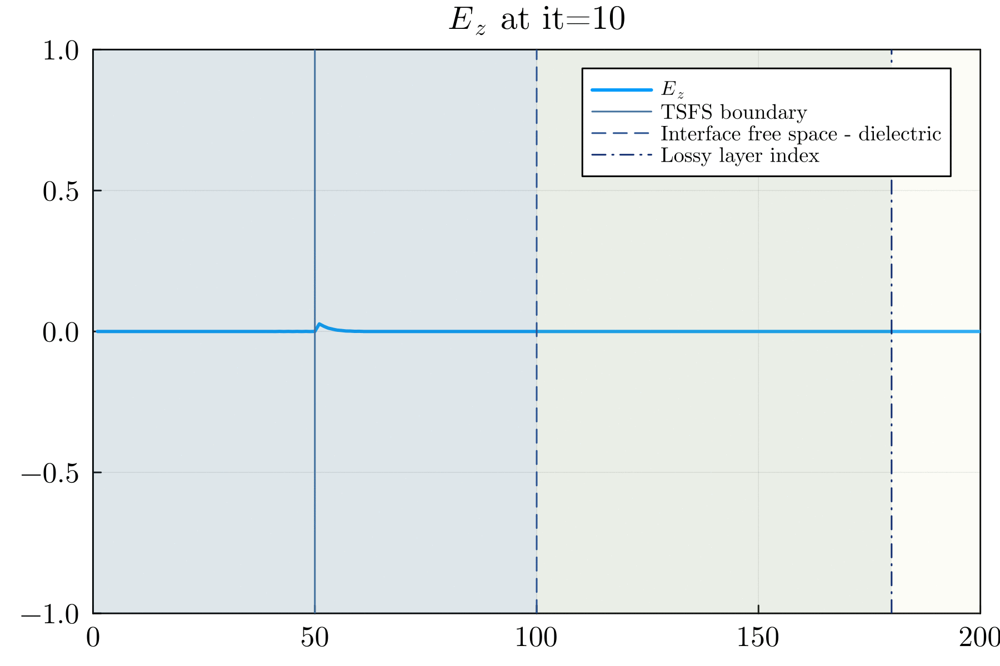
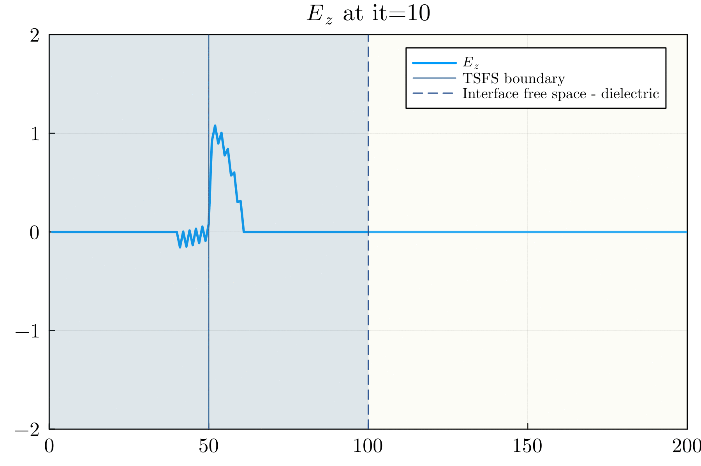

# MaxwellFDTD

[](https://github.com/gioelemo/MaxwellFDTD.jl/actions/workflows/CI.yml/badge.svg?branch=main)
[](https://codecov.io/github/gioelemo/MaxwellFDTD.jl)

## Contents

- [Introduction](#introduction)
- [Setup](#setup)
- [Maxwell's Equations](#maxwells-equations)
- [Numerical Methods](#numerical-methods)
- [1D FDTD](#1d-fdtd)
    -  [Mathematical Formulation](#mathematical-formulation)
    -  [Code](#code)
- [2D FDTD](#2d-fdtd)
    -  [Mathematical Formulation](#mathematical-formulation-1)
     -  [Code](#code-1)
- [3D FDTD](#3d-fdtd)
    -  [Mathematical Formulation](#mathematical-formulation-2)
    -  [Code](#code-2)
- [Testing](#testing)
- [Results and conclusions](#results-and-conclusions)
- [References](#references)

## Introduction

This repository hosts the implementation of a Maxwell equations solver using the Finite Differences Time Domain (FDTD) method in the Julia programming language, utilizing the  [ParallelStencil.jl](https://github.com/omlins/ParallelStencil.jl) and [ImplicitGlobalGrid.jl](https://github.com/eth-cscs/ImplicitGlobalGrid.jl) packages. 

We start with a simple 1D implementation and we extend the code to 2D and 3D employing both GPU and CPU architectures. The implementation was further augmented to encompass multi-xPU capabilities, leveraging MPI for communication. 

All tests were conducted locally on a MacBook Pro 2017 - 2.8 GHz Intel Core i7 quad-core processor or on the Piz Daint Supercomputer (CSCS - Lugano) using one or multiple NVIDIA Tesla P100 GPUs.

## Setup

The code can be run directly on Julia REPL by installing all the packages listed in [Project.toml](Project.toml) file. 

Most of the scripts come with a `shell` script which can be use in a SLURM cluster environment with the command

```bash
sbatch run_"name_of_program"_xPU.sh
```

All of the provided scripts can be run on CPU or GPU (and some of them on multiple xPUs).

## Maxwell's equations

Maxwell's equations are a set of four fundamental equations that describe the behavior of electric and magnetic fields in classical electromagnetism. These equations, formulated by James Clerk Maxwell in the 19th century, provide a comprehensive framework for understanding the generation and propagation of electromagnetic waves.

The formulas are given as [5]:
1. Gauss' law for electricity:
$$\nabla \cdot \boldsymbol{D} = \rho$$

2. Gauss' law for magnetism:
$$\nabla \cdot \boldsymbol{B} = 0$$


3. Faraday's law of induction:
$$\nabla \times \boldsymbol{E} = - \frac{\partial\boldsymbol{B}}{\partial t}$$

4. Ampere's law:
$$\nabla \times \boldsymbol{H} = J_c + \frac{\partial\boldsymbol{D}}{\partial t}$$

where:
- $\boldsymbol{E}$ is the electric field
- $\boldsymbol{B}$ is the magnetic field
- $\boldsymbol{D}$ is the electric displacement
- $\boldsymbol{H}$ is the magnetic field strength
- $J_c$ is the current density


we can additionaly have:

- Isotropic linear dielectric:
$$\boldsymbol{D} = \varepsilon \boldsymbol{E} $$

- Isotropic linear magnetic medium:
$$\boldsymbol{B} = \mu \boldsymbol{H} $$

where
- $\varepsilon$ is the permittivity
- $\mu$ is the permeability


For the isotropic case we can combine the previous equations and we get:

Faraday's law:
$$\nabla \times \boldsymbol{E} = - \mu\frac{\partial\boldsymbol{H}}{\partial t} \tag{1} $$

Ampere's law:
$$\nabla \times \boldsymbol{H} = J_c + \varepsilon\frac{\partial\boldsymbol{E}}{\partial t} \tag{2}$$

For a more detailed review of electromagnetics consider  [3] (Chapter 2  - Brief Review of Electromagnetics).

## Numerical Methods

To solve the equations it is possible to use the Finite Difference Time Domain Method (FDTD).

This method introduced by Kane S. Yee [1] consists of discretizing the time-dependent Maxwell's equation using a central finite-difference approach.

The finite-difference equations derived from this process are addressed in a leapfrog fashion, either through software or hardware. Initially, the electric field vector components within a specific spatial volume are resolved at a particular moment in time. Subsequently, the magnetic field vector components in the same spatial domain are addressed in the subsequent time step. This iterative process continues until the anticipated transient or steady-state electromagnetic field behavior is completely developed [2].

## 1D FDTD

The goal of this section is to provide a simple code for a Finite Difference Time domain simulator for solving a simple version of the Maxwell equations in 1D.

### Mathematical Formulation

We assume in this case that the electric field only has a $z$ component.

In this case Faraday's law (Equation 1) can be written as:

$$
-\mu \frac{\partial \boldsymbol{H}}{\partial t}=\nabla \times \boldsymbol{E}=\left|\begin{array}{ccc}
\hat{\boldsymbol{a}}_x & \hat{\boldsymbol{a}}_y & \hat{\boldsymbol{a}}_z \\
\frac{\partial}{\partial x} & 0 & 0 \\
0 & 0 & E_z
\end{array}\right|=-\hat{\boldsymbol{a}}_y \frac{\partial E_z}{\partial x} \tag{3} 
$$

And similarly Ampere's law (Equation 2) can be written as:

$$
\epsilon \frac{\partial \boldsymbol{E}}{\partial t}=\nabla \times \boldsymbol{H}=\left|\begin{array}{ccc}
\hat{\boldsymbol{a}}_x & \hat{\boldsymbol{a}}_y & \hat{\boldsymbol{a}}_z \\
\frac{\partial}{\partial x} & 0 & 0 \\
0 & H_y & 0
\end{array}\right|=\hat{\boldsymbol{a}}_z \frac{\partial H_y}{\partial x} \tag{4}
$$

The scalar equations form (3) and (4) in 1D are given as:

$$
\begin{align*}
\mu \frac{\partial H_y}{\partial t} &= \frac{\partial E_z}{\partial x} \tag{5}\\
\varepsilon \frac{\partial E_z}{\partial t} &= \frac{\partial H_y}{\partial x} \tag{6}
\end{align*}
$$

We can then transform the previous two equation using a finite difference approach as follow:

1. For $H_y$:

$$
\begin{align*}
\mu \frac{H_y^{q+\frac{1}{2}}\left[m+\frac{1}{2}\right]-H_y^{q-\frac{1}{2}}\left[m+\frac{1}{2}\right]}{\Delta_t}&=\frac{E_z^q[m+1]-E_z^q[m]}{\Delta_x} \\
H_y^{q+\frac{1}{2}}\left[m+\frac{1}{2}\right]&=H_y^{q-\frac{1}{2}}\left[m+\frac{1}{2}\right]+\frac{\Delta_t}{\mu \Delta_x}\left(E_z^q[m+1]-E_z^q[m]\right)
\end{align*}
$$

2.  For $E_z$:

$$
\begin{align*}
\varepsilon \frac{E_z^{q+1}[m]-E_z^q[m]}{\Delta_t}&=\frac{H_y^{q+\frac{1}{2}}\left[m+\frac{1}{2}\right]-H_y^{q+\frac{1}{2}}\left[m-\frac{1}{2}\right]}{\Delta_x}\\
E_z^{q+1}[m]&=E_z^q[m]+\frac{\Delta_t}{\varepsilon \Delta_x}\left(H_y^{q+\frac{1}{2}}\left[m+\frac{1}{2}\right]-H_y^{q+\frac{1}{2}}\left[m-\frac{1}{2}\right]\right)
\end{align*}
$$

where:
- $E_z^{q+1}[m]$: Electric field component $E_z$ at spatial position $m$ and time step $q+1$.

- $E_z^q[m]$: Electric field component $E_z$ at spatial position $m$ and time step $q$.

- $\varepsilon$: Permittivity of the medium.

- $\mu$: Permeability of the medium.

- $\Delta_t$: Time step size.

- $\Delta_x$: Spatial step size.

- $H_y^{q+\frac{1}{2}}\left[m+\frac{1}{2}\right]$: Magnetic field component $H_y$ at the half-integer spatial position $m+\frac{1}{2}$ and time step $q+\frac{1}{2}$.

- $H_y^{q+\frac{1}{2}}\left[m-\frac{1}{2}\right]$: Magnetic field component $H_y$ at the half-integer spatial position $m-\frac{1}{2}$ and time step $q+\frac{1}{2}$.

We can additionally define the Courant number $S_c$ as
$$S_c := \frac{c \Delta_t}{\Delta_x}$$

### Code
The method of the previous subsection is implemented in the [1D_maxwell_additive_source_lossy_layer.jl](./scripts/1D_maxwell_additive_source_lossy_layer.jl) file.

We can use the following update equations when working with integer indexes and assuming that $S_c=1$:

- The magnetic-field nodes can be updated with:
`hy[m] = hy[m] + (ez[m + 1] - ez[m]) / imp0`

- The electric-field nodes can be updated with: `ez[m] = ez[m] + (hy[m] - hy[m - 1]) * imp0`

where `imp0` is the characteristic impedance of free space (approximately 377 $\Omega$).

In this code is also additionally implemented:

1. Additive source in an explicit point of the domain (i.e. at the TSFS boundary). This source can be a Gaussian function (with specified width and location) or a sinusoidal function. This is done in the `correct_E_z()` functions. 

2. A Total-Field/Scattered-Field (TFSF) Boundary which separate the total field into incident and scattered components, allowing for accurate characterization of the scattered electromagnetic waves in the vicinity of the simulation domain.

3. An absorbing boundary condition (ABC) on the left part of the $E_z$ field to simulate an open and infinite environment by introducing a boundary that absorbs outgoing waves, minimizing reflections from the simulation domain boundaries. This is done in `ABC_bc()` function.

4. An interface index between free space and dielectric space (controlled by the `interface_index` parameter) 

5. A lossy region where some loss is introduced (controlled by the `loss_layer_index` , `epsR` and `loss` variables).

We first run the code for the Gaussian source case with the following parameters:

```julia
nx   = 200    # number space steps
nt   = 450    # number timesteps
nvis = 10     # interval visualisation
src  = "exp"  # Gaussian source
imp0 = 377.0  # free space impedance
loss = 0.02   # loss factor
interface_index = 100  # interface index between free space-dielectric
epsR = 9.0    # relative permittivity
loss_layer_index     = 180   # loss layer index
TSFS_boundary_index  = 50    # TSFS index
Cdt_dx   = 1.0   # Courant's number
width    = 100.0 # width of  Gaussian pulse
location = 30.0  # location of Gaussian pulse
```

After running the code with 
`sbatch run_1D_maxwell_lossy_layer_xPU.sh` (works for both CPU and GPU by changing the `USE_GPU` flag in the [1D_maxwell_additive_source_lossy_layer.jl](./scripts/1D_maxwell_additive_source_lossy_layer.jl) file.) we get the following animation for the $E_z$ field

||
|:--:| 
| *Maxwell FDTD 1D simulation nx=200, nt=450 - Ez field, exp source* |

As we can see the additive source is added at the TSFS boundary (at index 50). The "wave" is then propagated until the interface between the free-space and the dielectric region (at index 100) where one part get reflected and the other part continues into the dielectric region. At the lossy layer index (at index 180) we start to introduce loss in the simulation, this the magnitude of the wave start to decrease. 

It is also possible to observe that at the left part of the computational domain, the wave is not reflected. This is due to the use of Absorbing Boundary Conditions (ABC).

Similar as before we can run the code with a sin source with the following parameters:

```julia
nx   = 200    # number space steps
nt   = 450    # number timesteps
nvis = 10     # interval visualisation
src  = "sin"  # Sin source
imp0 = 377.0  # free space impedance
loss = 0.0253146   # loss factor
interface_index = 100  # interface index between free space-dielectric
epsR = 4.0       # relative permittivity
N_lambda = 40.0  # number of points per wavelengths
TSFS_boundary_index  = 50    # TSFS index
Cdt_dx   = 1.0   # Courant's number
location = 0.0   # location of Gaussian pulse
```

After running the code with 
`sbatch run_1D_maxwell_lossy_layer_xPU.sh` (works for both CPU and GPU by changing the `USE_GPU` flag in the [1D_maxwell_additive_source_lossy_layer.jl](./scripts/1D_maxwell_additive_source_lossy_layer.jl) file.) we get the following animation for the $E_z$ field

||
|:--:|
| *Maxwell FDTD 1D simulation nx=200, nt=450 - Ez field, sin source* |

As in the previous example, we can also see here that the additive source is added at the TSFS boundary (at index 50). The "wave" is then propagated until the interface between the free-space and the dielectric region (at index 100) where one part get reflected and the other part continues into the dielectric region. In this case we start to introduce loss directly at the start of the dielectric region (and not later as done in the previous example) in the simulation, this the magnitude of the wave start to decrease. 

Also here, tt is possible to observe that at the left part of the computational domain, the wave is not reflected. This is due to the use of Absorbing Boundary Conditions (ABC).


## 2D FDTD

### Mathematical Formulation
By starting with the Maxwell's equation given in [this](#maxwells-equations) section, we get, in a similar way as in the 1D case the following equations ($TE^z$ polarization):

$$
\begin{align*}
\sigma E_x + \varepsilon \frac{\partial E_x}{\partial t} &= \frac{\partial H_z}{\partial y} \tag{7}\\
\sigma E_y + \varepsilon \frac{\partial E_y}{\partial t} &= -\frac{\partial H_z}{\partial x} \tag{8} \\
-\sigma_m H_z - \mu\frac{\partial H_z}{\partial t} &= \frac{\partial E_y}{\partial x} - \frac{\partial E_x}{\partial y} \tag{9}
\end{align*}
$$

We can transform the previous equation using finite difference into the following set of 2D update equations:

1. For $E_x$ (Electric field in $x$-direction from Equation (7))

$$
E_x[:, 2:\text{end}-1] += \frac{\Delta t}{\varepsilon} \left( -\sigma \cdot E_x[:, 2:\text{end}-1] +  \frac{\partial H_z}{\partial y}\right)
$$

2. For $E_y$ (Electric field in $y$-direction from Equation (8))

$$
E_y[2:\text{end}-1,:] += \frac{\Delta t}{\varepsilon} \left( -\sigma \cdot E_y[2:\text{end}-1,:] +  \frac{\partial H_z}{\partial x}\right)
$$


3. For $H_z$ (Magnetic field in $z$-direction from Equation (9))

$$
H_z +=  \frac{\Delta t}{\mu}\left(-\sigma \cdot H_z + \frac{\partial E_x}{\partial y} - \frac{\partial E_y}{\partial x}\right)
$$

The Absorbing Boundary Conditions (ABC) of the 1D case can not efficiently transformed to the 2D example. We thus need to implement Perfectly Matched Layer (PML) Boundary Conditions as introduced in [4]. 

The PML boundary conditions are applied to absorb outgoing waves. In the code, this is done using the following update equations for PML regions:

1. Update Equation for PML in $x$-direction (for $E_x$):

$$
E_x[i,j] = e^{-(\text{pml width}-i)\cdot\text{pml alpha}}\cdot E_x[i,j]
$$

(applied to the first and last $\text{pml width}$ rows of $E_x$).

2. Update Equation for PML in $y$-direction (for $E_y$):

$$
E_y[j,i] = e^{-(\text{pml width}-i)\cdot\text{pml alpha}}\cdot E_y[j,i]
$$

(applied to the first and last $\text{pml width}$ rows of $E_y$).

where:
- $\text{pml width}$: is the width of the extension of the domain in $x$ and $y$ direction.
- $\text{pml alpha}$: is the factor which control the effect of the PML boundary.


### Code
The mathematical formulation of the previous subsection can be translated into code. This code can be found in [2D_maxwell_pml_xPU](./scripts/2D_maxwell_pml_xPU.jl)
The structure of the code is similar to the one of the 1D code.

We can run the code using
`sbatch run_2D_maxwell_pml_xPU.sh` (works for both CPU and GPU by changing the `USE_GPU` flag in the [2D_maxwell_pml_xPU](./scripts/2D_maxwell_pml_xPU.jl) file.) with the following parameters:

```julia
# physics
lx, ly = 40.0, 40.0    # physical size
ε0 = 1.0               # permittivity
μ0 = 1.0               # permeability
σ = 1.0                # electrical conductivity

# numerics
nx, ny = 255, 256      # number space steps

# PML parameters
pml_width = 50         # PML extensions

# Extend the grid
nx_pml, ny_pml = nx + 2 * pml_width, ny + 2 * pml_width

nt   = 15000           # number of time steps
nvis = 100             # visualisation interval
```

We test the code with different values of $\text{pml alpha}$

1. $\text{pml alpha}=0.0$ (i.e. no PML boundary)

The resulting animation is given as:

||
|:--:|
| *Maxwell FDTD 2D simulation nx=255, ny=256, nt=15000, nvis=100, alpha=0.0 - Hz field*|

The black square represent the distinction between the original computational domain and the extended domain when adding the PML layer. 

In this case we observe that no waves are absorbed by the PML since the value of $\text{pml alpha}=0.0$.

2. $\text{pml alpha}=0.1$ (i.e. slightly PML boundary)

The resulting animation is given as:

||
|:--:|
| *Maxwell FDTD 2D simulation nx=255, ny=256, nt=15000, nvis=100, alpha=0.1 - Hz field*|

Different as the previous case we observe that some waves are partially absorbed by the PML because we use a value of $\text{pml alpha}=0.1$.

3. $\text{pml alpha}=5.0$ (i.e. PML boundary)

The resulting animation is given as:

||
|:--:|
| *Maxwell FDTD 2D simulation nx=255, ny=256, nt=15000, nvis=100, alpha=5.0 - Hz field*|

Similar to the previous case we observe that some waves are partially absorbed by the PML because we use a value of $\text{pml alpha}=5.0$. The absorbtion is a bit big compared to the previous case, but it is very difficult to see from this animation.


## 3D FDTD

### Mathematical Formulation

TODO: Explain formulas in 3D 

### Code

TODO: results

## Testing

For all implementations (1D, 2D, 3D) we perform some unit and reference testing. For more details of the testing we refer directly to the test files [test1D.jl](./test/test1D.jl), [test2D.jl](./test/test2D.jl), [test3D.jl](./test/test3D.jl)

## Results and conclusions

TODO: Write some conclusion and to what extent the code can be extended

## References

[1] Kane Yee (1966). "Numerical solution of initial boundary value problems involving Maxwell's equations in isotropic media". IEEE Transactions on Antennas and Propagation. 14 (3): 302–307.

[2] Finite-difference time-domain method - Wikipedia
[https://en.wikipedia.org/wiki/Finite-difference_time-domain_method](https://en.wikipedia.org/wiki/Finite-difference_time-domain_method)

[3] Understanding the Finite-Difference Time-Domain Method, John B. Schneider, [www.eecs.wsu.edu/~schneidj/ufdtd](www.eecs.wsu.edu/~schneidj/ufdtd), 2010. (also [here](./references/ufdtd.pdf))

[4] Berenger, Jean-Pierre. "A perfectly matched layer for the absorption of electromagnetic waves." Journal of computational physics 114.2 (1994): 185-200 (also [here](./references/APerfectlyMatchedLayerfortheAbsorptionofElectromagneticWaves.pdf))

[5] Hyperphisics.phy-astr.gsu.edu, Maxwell's Equations, http://hyperphysics.phy-astr.gsu.edu/hbase/electric/maxeq.html
