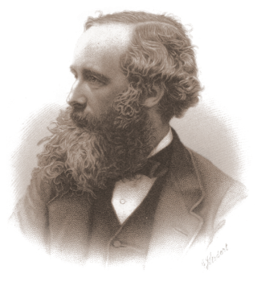
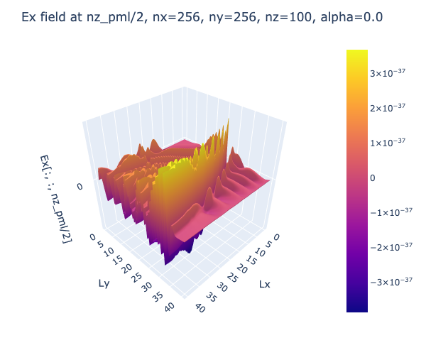
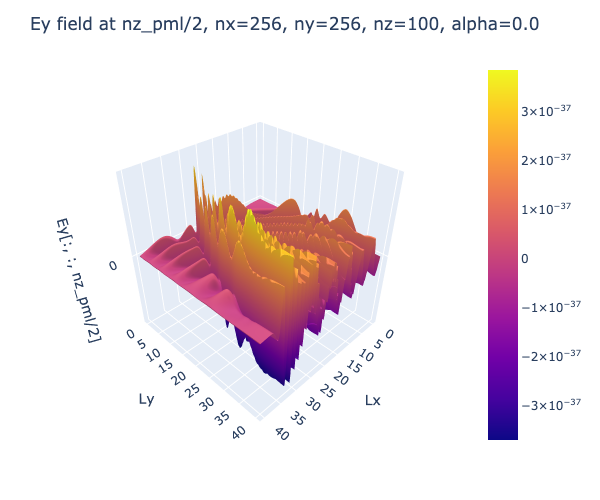
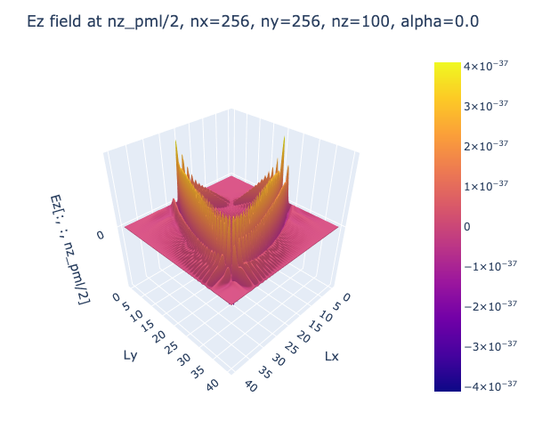
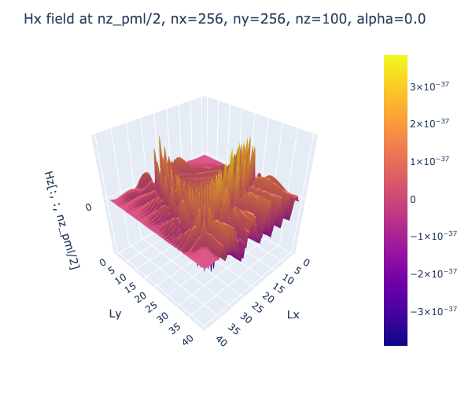
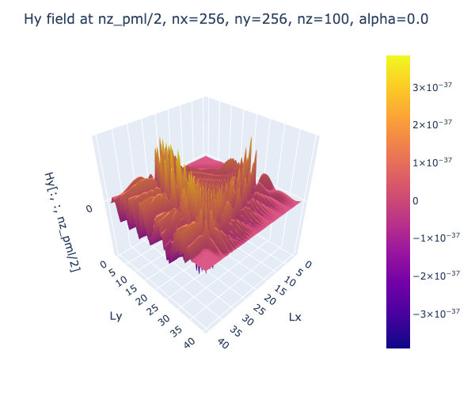
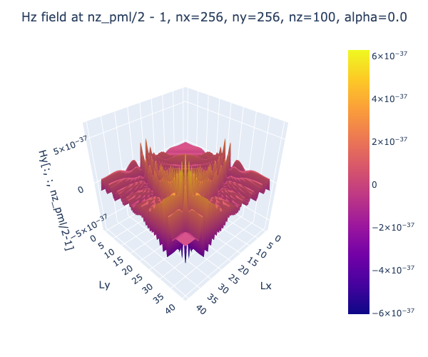

<h1>  MaxwellFDTD.jl </h1>

[](https://github.com/gioelemo/MaxwellFDTD.jl/actions/workflows/CI.yml/badge.svg?branch=main)
[](https://codecov.io/github/gioelemo/MaxwellFDTD.jl)

## Contents

- [Introduction](#introduction)
- [Setup](#setup)
- [Maxwell's Equations](#maxwells-equations)
- [Numerical Methods](#numerical-methods)
- [1D FDTD](#1d-fdtd)
    -  [Mathematical Formulation](#mathematical-formulation)
    -  [Code](#code)
- [2D FDTD](#2d-fdtd)
    -  [Mathematical Formulation](#mathematical-formulation-1)
     -  [Code](#code-1)
- [3D FDTD](#3d-fdtd)
    -  [Mathematical Formulation](#mathematical-formulation-2)
    -  [Code](#code-2)
- [Testing](#testing)
- [Results and conclusions](#results-and-conclusions)
- [References](#references)

## Introduction

This repository hosts the implementation of a Maxwell equations solver using the Finite Differences Time Domain (FDTD) method in the Julia programming language. The implementation utilizes the  [ParallelStencil.jl](https://github.com/omlins/ParallelStencil.jl) and [ImplicitGlobalGrid.jl](https://github.com/eth-cscs/ImplicitGlobalGrid.jl) packages. 

We initially develop a simple 1D implementation and subsequently extend the code to 2D and 3D, taking advantage of both GPU and CPU architectures. The implementation has been enhanced to support multi-xPU capabilities, making use of MPI for communication.

All tests were performed locally on a MacBook Pro 2017 with a 2.8 GHz Intel Core i7 quad-core processor. Additionally, testing was conducted on the Piz Daint Supercomputer at CSCS in Lugano, employing one or multiple NVIDIA Tesla P100 GPUs.

## Setup

The code can be run directly on Julia REPL by installing all the packages listed in [Project.toml](Project.toml) file. 

For ease of use in a SLURM cluster environment, most scripts are accompanied by a `shell` script. This script can be employed with the following command:

```bash
sbatch run_"name_of_program".sh
```

It is noteworthy that all provided scripts are compatible with both CPU and GPU execution, with certain scripts supporting multiple xPU configurations.

## Maxwell's equations

Maxwell's equations are a set of four fundamental equations that describe the behavior of electric and magnetic fields in classical electromagnetism. These equations, formulated by James Clerk Maxwell in the 19th century, provide a comprehensive framework for understanding the generation and propagation of electromagnetic waves.

The formulas are given as [5]:
1. Gauss' law for electricity:
$$\nabla \cdot \boldsymbol{D} = \rho$$

2. Gauss' law for magnetism:
$$\nabla \cdot \boldsymbol{B} = 0$$


3. Faraday's law of induction:
$$\nabla \times \boldsymbol{E} = - \frac{\partial\boldsymbol{B}}{\partial t}$$

4. Ampere's law:
$$\nabla \times \boldsymbol{H} = J_c + \frac{\partial\boldsymbol{D}}{\partial t}$$

where:
- $\boldsymbol{E}$ is the electric field
- $\boldsymbol{B}$ is the magnetic field
- $\boldsymbol{D}$ is the electric displacement
- $\boldsymbol{H}$ is the magnetic field strength
- $J_c$ is the current density


we can additionaly have:

- Isotropic linear dielectric:
$$\boldsymbol{D} = \varepsilon \boldsymbol{E} $$

- Isotropic linear magnetic medium:
$$\boldsymbol{B} = \mu \boldsymbol{H} $$

where
- $\varepsilon$ is the permittivity
- $\mu$ is the permeability


For the isotropic case we can combine the previous equations and we get:

Faraday's law:
$$\nabla \times \boldsymbol{E} = - \mu\frac{\partial\boldsymbol{H}}{\partial t} \tag{1} $$

Ampere's law:
$$\nabla \times \boldsymbol{H} = J_c + \varepsilon\frac{\partial\boldsymbol{E}}{\partial t} \tag{2}$$

For a more detailed review of electromagnetics consider  [3] (Chapter 2  - Brief Review of Electromagnetics).

## Numerical Methods

To solve the equations of the previous section it is possible to use the Finite Difference Time Domain Method (FDTD).

This method introduced by Kane S. Yee [1] consists of discretizing the time-dependent Maxwell's equation using a central finite-difference approach.

The finite-difference equations derived from this process are addressed in a leapfrog fashion, either through software or hardware. Initially, the electric field vector components within a specific spatial volume are resolved at a particular moment in time. Subsequently, the magnetic field vector components in the same spatial domain are addressed in the subsequent time step. This iterative process continues until the anticipated transient or steady-state electromagnetic field behavior is completely developed [2].

## 1D FDTD

The objective of this section is to present a straightforward code implementation for a Finite Difference Time Domain simulator designed to solve a simplified version of Maxwell's equations in 1D.

### Mathematical Formulation

In this scenario, it is assumed that the electric field only possesses a $z$ component.

In this specific case, Faraday's law (Equation 1) can be expressed as:

$$
-\mu \frac{\partial \boldsymbol{H}}{\partial t}=\nabla \times \boldsymbol{E}=\left|\begin{array}{ccc}
\hat{\boldsymbol{a}}_x & \hat{\boldsymbol{a}}_y & \hat{\boldsymbol{a}}_z \\
\frac{\partial}{\partial x} & 0 & 0 \\
0 & 0 & E_z
\end{array}\right|=-\hat{\boldsymbol{a}}_y \frac{\partial E_z}{\partial x} \tag{3} 
$$

And similarly Ampere's law (Equation 2) can be written as:

$$
\epsilon \frac{\partial \boldsymbol{E}}{\partial t}=\nabla \times \boldsymbol{H}=\left|\begin{array}{ccc}
\hat{\boldsymbol{a}}_x & \hat{\boldsymbol{a}}_y & \hat{\boldsymbol{a}}_z \\
\frac{\partial}{\partial x} & 0 & 0 \\
0 & H_y & 0
\end{array}\right|=\hat{\boldsymbol{a}}_z \frac{\partial H_y}{\partial x} \tag{4}
$$

The scalar equations form (3) and (4) in 1D are given as:

$$
\begin{align*}
\mu \frac{\partial H_y}{\partial t} &= \frac{\partial E_z}{\partial x} \tag{5}\\
\varepsilon \frac{\partial E_z}{\partial t} &= \frac{\partial H_y}{\partial x} \tag{6}
\end{align*}
$$

We can subsequently transform the preceding two equations using a finite difference approach as follows:

1. For $H_y$:

$$
\begin{align*}
\mu \frac{H_y^{q+\frac{1}{2}}\left[m+\frac{1}{2}\right]-H_y^{q-\frac{1}{2}}\left[m+\frac{1}{2}\right]}{\Delta_t}&=\frac{E_z^q[m+1]-E_z^q[m]}{\Delta_x} \\
H_y^{q+\frac{1}{2}}\left[m+\frac{1}{2}\right]&=H_y^{q-\frac{1}{2}}\left[m+\frac{1}{2}\right]+\frac{\Delta_t}{\mu \Delta_x}\left(E_z^q[m+1]-E_z^q[m]\right)
\end{align*}
$$

2.  For $E_z$:

$$
\begin{align*}
\varepsilon \frac{E_z^{q+1}[m]-E_z^q[m]}{\Delta_t}&=\frac{H_y^{q+\frac{1}{2}}\left[m+\frac{1}{2}\right]-H_y^{q+\frac{1}{2}}\left[m-\frac{1}{2}\right]}{\Delta_x}\\
E_z^{q+1}[m]&=E_z^q[m]+\frac{\Delta_t}{\varepsilon \Delta_x}\left(H_y^{q+\frac{1}{2}}\left[m+\frac{1}{2}\right]-H_y^{q+\frac{1}{2}}\left[m-\frac{1}{2}\right]\right)
\end{align*}
$$

where:
- $E_z^{q+1}[m]$: Electric field component $E_z$ at spatial position $m$ and time step $q+1$.

- $E_z^q[m]$: Electric field component $E_z$ at spatial position $m$ and time step $q$.

- $\varepsilon$: Permittivity of the medium.

- $\mu$: Permeability of the medium.

- $\Delta_t$: Time step size.

- $\Delta_x$: Spatial step size.

- $H_y^{q+\frac{1}{2}}\left[m+\frac{1}{2}\right]$: Magnetic field component $H_y$ at the half-integer spatial position $m+\frac{1}{2}$ and time step $q+\frac{1}{2}$.

- $H_y^{q+\frac{1}{2}}\left[m-\frac{1}{2}\right]$: Magnetic field component $H_y$ at the half-integer spatial position $m-\frac{1}{2}$ and time step $q+\frac{1}{2}$.

We can additionally define the Courant number $S_c$ as
$$S_c := \frac{c \Delta_t}{\Delta_x}$$

### Code
The method described in the previous subsection is implemented in the [1D_maxwell_additive_source_lossy_layer.jl](./scripts/1D_maxwell_additive_source_lossy_layer.jl) file.

The following update equations can be employed when working with integer indices and assuming that $S_c=1$:

- The magnetic-field nodes can be updated with:
`hy[m] = hy[m] + (ez[m + 1] - ez[m]) / imp0`

- The electric-field nodes can be updated with: `ez[m] = ez[m] + (hy[m] - hy[m - 1]) * imp0`

where `imp0` is the characteristic impedance of free space (approximately 377 $\Omega$).

In this code is also additionally implemented:

1. Additive source in an explicit point of the domain (i.e. at the TSFS boundary). This source can be a Gaussian function (with specified width and location) or a sinusoidal function. This is done in the `correct_E_z()` functions. 

2. A Total-Field/Scattered-Field (TFSF) Boundary which separate the total field into incident and scattered components, allowing for accurate characterization of the scattered electromagnetic waves in the vicinity of the simulation domain.

3. An absorbing boundary condition (ABC) on the left part of the $E_z$ field to simulate an open and infinite environment by introducing a boundary that absorbs outgoing waves, minimizing reflections from the simulation domain boundaries. This is done in `ABC_bc()` function.

4. An interface index between free space and dielectric space (controlled by the `interface_index` parameter) 

5. A lossy region where some loss is introduced (controlled by the `loss_layer_index` , `epsR` and `loss` variables).

We first run the code for the Gaussian source case with the following parameters:

```julia
nx   = 200    # number space steps
nt   = 450    # number timesteps
nvis = 10     # interval visualisation
src  = "exp"  # Gaussian source
imp0 = 377.0  # free space impedance
loss = 0.02   # loss factor
interface_index = 100  # interface index between free space-dielectric
epsR = 9.0    # relative permittivity
loss_layer_index     = 180   # loss layer index
TSFS_boundary_index  = 50    # TSFS index
Cdt_dx   = 1.0   # Courant's number
width    = 100.0 # width of  Gaussian pulse
location = 30.0  # location of Gaussian pulse
```

After running the code with 
`sbatch run_1D_maxwell_lossy_layer_xPU.sh` (works for both CPU and GPU by changing the `USE_GPU` flag in the [1D_maxwell_additive_source_lossy_layer.jl](./scripts/1D_maxwell_additive_source_lossy_layer.jl) file.) we get the following animation for the $E_z$ field

||
|:--:| 
| *Maxwell FDTD 1D simulation nx=200, nt=450 - Ez field, exp source* |

As observed, the additive source is introduced at the TSFS boundary (at index 50). Subsequently, the "wave" propagates until reaching the interface between the free-space and the dielectric region (at index 100), where a portion undergoes reflection, and the remainder continues into the dielectric region. Upon reaching the index of the lossy layer (at index 180), the simulation introduces loss, causing a reduction in the magnitude of the wave. 

It is noteworthy that on the left part of the computational domain, the wave is not reflected, a behavior attributed to the utilization of Absorbing Boundary Conditions (ABC).

Similarly, as in the previous case, the code can be executed with a sine source using the following parameters:

```julia
nx   = 200    # number space steps
nt   = 450    # number timesteps
nvis = 10     # interval visualisation
src  = "sin"  # Sin source
imp0 = 377.0  # free space impedance
loss = 0.0253146   # loss factor
interface_index = 100  # interface index between free space-dielectric
epsR = 4.0       # relative permittivity
N_lambda = 40.0  # number of points per wavelengths
TSFS_boundary_index  = 50    # TSFS index
Cdt_dx   = 1.0   # Courant's number
location = 0.0   # location of Gaussian pulse
```

After running the code with 
`sbatch run_1D_maxwell_lossy_layer_xPU.sh` (works for both CPU and GPU by changing the `USE_GPU` flag in the [1D_maxwell_additive_source_lossy_layer.jl](./scripts/1D_maxwell_additive_source_lossy_layer.jl) file.) we get the following animation for the $E_z$ field

||
|:--:|
| *Maxwell FDTD 1D simulation nx=200, nt=450 - Ez field, sin source* |

Similar to the previous example, it is evident that the additive source is introduced at the TSFS boundary (at index 50). Subsequently, the "wave" propagates until reaching the interface between the free-space and the dielectric region (at index 100), where a portion undergoes reflection, and the remainder continues into the dielectric region. Notably, in this case, loss is introduced right at the beginning of the dielectric region in the simulation, leading to a gradual decrease in the magnitude of the wave.

Moreover, as observed before, on the left part of the computational domain, the wave is not reflected, attributed to the implementation of Absorbing Boundary Conditions (ABC).

## 2D FDTD

### Mathematical Formulation
Starting with the Maxwell's equation given in [ Maxwell's equation](#maxwells-equations) section, we obtain, in a manner analogous to the 1D case, the following equations ($TE^z$ polarization):

$$
\begin{align*}
\sigma E_x + \varepsilon \frac{\partial E_x}{\partial t} &= \frac{\partial H_z}{\partial y} \tag{7}\\
\sigma E_y + \varepsilon \frac{\partial E_y}{\partial t} &= -\frac{\partial H_z}{\partial x} \tag{8} \\
-\sigma_m H_z - \mu\frac{\partial H_z}{\partial t} &= \frac{\partial E_y}{\partial x} - \frac{\partial E_x}{\partial y} \tag{9}
\end{align*}
$$

The preceding equations can be transformed using finite difference methods into the following set of 2D update equations:

1. For $E_x$ (Electric field in $x$-direction from Equation (7))

$$
E_x[:, 2:\text{end}-1] += \frac{\Delta t}{\varepsilon} \left( -\sigma \cdot E_x[:, 2:\text{end}-1] +  \frac{\partial H_z}{\partial y}\right)
$$

2. For $E_y$ (Electric field in $y$-direction from Equation (8))

$$
E_y[2:\text{end}-1,:] += \frac{\Delta t}{\varepsilon} \left( -\sigma \cdot E_y[2:\text{end}-1,:] +  \frac{\partial H_z}{\partial x}\right)
$$


3. For $H_z$ (Magnetic field in $z$-direction from Equation (9))

$$
H_z +=  \frac{\Delta t}{\mu}\left(-\sigma \cdot H_z + \frac{\partial E_x}{\partial y} - \frac{\partial E_y}{\partial x}\right)
$$

The Absorbing Boundary Conditions (ABC) of the 1D case can not efficiently transformed to the 2D example. We thus need to implement Perfectly Matched Layer (PML) Boundary Conditions as introduced in [4]. 

The PML boundary conditions are applied to absorb outgoing waves. In the code, this is done using the following update equations for PML regions:

1. Update Equation for PML in $x$-direction (for $E_x$):

$$
E_x[i,j] = e^{-(\text{pml width}-i)\cdot\text{pml alpha}}\cdot E_x[i,j]
$$

(applied to the first and last $\text{pml width}$ rows of $E_x$).

2. Update Equation for PML in $y$-direction (for $E_y$):

$$
E_y[j,i] = e^{-(\text{pml width}-i)\cdot\text{pml alpha}}\cdot E_y[j,i]
$$

(applied to the first and last $\text{pml width}$ rows of $E_y$).

where:
- $\text{pml width}$: is the width of the extension of the domain in $x$ and $y$ direction.
- $\text{pml alpha}$: is the factor which control the effect of the PML boundary.


### Code
The mathematical formulation of the previous subsection can be translated into code. This code can be found in [2D_maxwell_pml_xPU](./scripts/2D_maxwell_pml_xPU.jl).

The structure of the code is similar to the one of the 1D code.

We can run the code using
`sbatch run_2D_maxwell_pml_xPU.sh` (works for both CPU and GPU by changing the `USE_GPU` flag in the [2D_maxwell_pml_xPU](./scripts/2D_maxwell_pml_xPU.jl) file.) with the following parameters:

```julia
# physics
lx, ly = 40.0, 40.0    # physical size
ε0 = 1.0               # permittivity
μ0 = 1.0               # permeability
σ = 1.0                # electrical conductivity

# numerics
nx, ny = 255, 256      # number space steps

# PML parameters
pml_width = 50         # PML extensions

# Extend the grid
nx_pml, ny_pml = nx + 2 * pml_width, ny + 2 * pml_width

nt   = 15000           # number of time steps
nvis = 100             # visualisation interval
```

We test the code with different values of $\text{pml alpha}$

1. $\text{pml alpha}=0.0$ (i.e. no PML boundary)

The resulting animation is given as:

||
|:--:|
| *Maxwell FDTD 2D simulation nx=255, ny=256, nt=15000, nvis=100, alpha=0.0 - Hz field*|

The black square represent the distinction between the original computational domain and the extended domain when adding the PML layer. 

In this case we observe that no waves are absorbed by the PML since the value of $\text{pml alpha}=0.0$.

2. $\text{pml alpha}=0.1$ (i.e. slightly PML boundary)

The resulting animation is given as:

||
|:--:|
| *Maxwell FDTD 2D simulation nx=255, ny=256, nt=15000, nvis=100, alpha=0.1 - Hz field*|

Different as the previous case we observe that some waves are partially absorbed by the PML because we use a value of $\text{pml alpha}=0.1$.

3. $\text{pml alpha}=5.0$ (i.e. PML boundary)

The resulting animation is given as:

||
|:--:|
| *Maxwell FDTD 2D simulation nx=255, ny=256, nt=15000, nvis=100, alpha=5.0 - Hz field*|

Similar to the previous case we observe that some waves are partially absorbed by the PML because we use a value of $\text{pml alpha}=5.0$. The absorbtion is a bit big compared to the previous case, but it is very difficult to see from this animation.


## 3D FDTD

### Mathematical Formulation

Starting with the Maxwell's equation given in [Maxwell's equation](#maxwells-equations) section, we get, in a similar way as in the 2D case the following equations ($TE^z$ and $TM^z$ polarizations):

$$
\begin{align*}
\sigma E_x + \varepsilon \frac{\partial E_x}{\partial t} &= \frac{\partial H_z}{\partial y} - \frac{\partial H_y}{\partial z}\tag{10}\\
\sigma E_y + \varepsilon \frac{\partial E_y}{\partial t} &= \frac{\partial H_x}{\partial z}-\frac{\partial H_z}{\partial x} \tag{11} \\
\sigma E_z + \varepsilon \frac{\partial E_z}{\partial t} &= \frac{\partial H_y}{\partial x}-\frac{\partial H_x}{\partial y} \tag{12} \\
-\sigma_m H_x - \mu\frac{\partial H_x}{\partial t} &= \frac{\partial E_z}{\partial y} - \frac{\partial E_y}{\partial z} \tag{13}\\
-\sigma_m H_y - \mu\frac{\partial H_y}{\partial t} &= \frac{\partial E_x}{\partial z} - \frac{\partial E_z}{\partial x} \tag{14}\\
-\sigma_m H_z - \mu\frac{\partial H_z}{\partial t} &= \frac{\partial E_y}{\partial x} - \frac{\partial E_x}{\partial y} \tag{15}
\end{align*}
$$

The preceding equation can be transformed using finite difference methods into the following set of 3D update equations:

1. For $E_x$ (Electric field in $x$-direction from Equation (10))

$$
E_x += \frac{\Delta t}{\varepsilon} \left( -\sigma \cdot E_x +  \frac{\partial H_z}{\partial y} -  \frac{\partial H_y}{\partial z}\right)
$$

2. For $E_y$ (Electric field in $y$-direction from Equation (11))

$$
E_y += \frac{\Delta t}{\varepsilon} \left( -\sigma \cdot E_y + \frac{\partial H_x}{\partial z} - \frac{\partial H_z}{\partial x}\right)
$$

3. For $E_z$ (Electric field in $z$-direction from Equation (12))

$$
E_z += \frac{\Delta t}{\varepsilon} \left( -\sigma \cdot E_y + \frac{\partial H_y}{\partial x} - \frac{\partial H_x}{\partial y}\right)
$$

4. For $H_x$ (Magnetic field in $x$-direction from Equation (13))

$$
H_x +=  \frac{\Delta t}{\mu}\left(-\sigma \cdot H_z + \frac{\partial E_y}{\partial z} - \frac{\partial E_z}{\partial y}\right)
$$

5. For $H_y$ (Magnetic field in $y$-direction from Equation (14))

$$
H_y +=  \frac{\Delta t}{\mu}\left(-\sigma \cdot H_z + \frac{\partial E_z}{\partial x} - \frac{\partial E_x}{\partial z}\right)
$$

6. For $H_z$ (Magnetic field in $z$-direction from Equation (15))

$$
H_z +=  \frac{\Delta t}{\mu}\left(-\sigma \cdot H_z + \frac{\partial E_x}{\partial y} - \frac{\partial E_y}{\partial x}\right)
$$

Similar to the 2D case we need to implement Perfectly Matched Layer (PML) Boundary Conditions as introduced in [4]. 

The PML boundary conditions are applied to absorb outgoing waves. In the code, this is done using the following update equations for PML regions:

1. Update Equation for PML in $x$-direction (for $E_x$):

$$
E_x[i,j,k] = e^{-(\text{pml width}-i)\cdot\text{pml alpha}}\cdot E_x[i,j,k]
$$

(applied to the first and last $\text{pml width}$ rows of $E_x$).

2. Update Equation for PML in $y$-direction (for $E_y$):

$$
E_y[i,j,k] = e^{-(\text{pml width}-j)\cdot\text{pml alpha}}\cdot E_y[i,j,k]
$$

(applied to the first and last $\text{pml width}$ rows of $E_y$).

3. Update Equation for PML in $z$-direction (for $E_z$):

$$
E_z[i,j,k] = e^{-(\text{pml width}-k)\cdot\text{pml alpha}}\cdot E_y[i,j,k]
$$

(applied to the first and last $\text{pml width}$ rows of $E_z$).

where:
- $\text{pml width}$: is the width of the extension of the domain in $x$ and $y$ direction.
- $\text{pml alpha}$: is the factor which control the effect of the PML boundary.


### Code

The mathematical formulation of the previous subsection can be translated into code. This code can be found in [3D_maxwell_pml_xPU](./scripts/3D_maxwell_pml_xPU.jl).

The structure of the code is similar to the one of the 2D code.

TODO: results
ALPHA =0.0

SURFACES

||||
|:--:| :--: | :--: |
| *Ex field at nz/2*| *Ey field at nz/2* | *Ez field at nz/2* |

||||
|:--:| :--: | :--: |
| *Hx field at nz/2*| *Hy field at nz/2* | *Hz field at nz/2-1* |

ANIMATIONS

||||
|:--:| :--: | :--: |
| *Ex field*| *Ey field* | *Ez field* |

||||
|:--:| :--: | :--: |
| *Hx field*| *Hy field* | *Hz field*|

## Testing

In all implementations (1D, 2D, 3D), we perform some unit and reference tests. For more details of the testing, we refer directly to the test files [test1D.jl](./test/test1D.jl), [test2D.jl](./test/test2D.jl), [test3D.jl](./test/test3D.jl). Please note that the coverage reported at the beginning of this file might be incorrect (did not have the time to find a fix).

## Results and conclusions

TODO: Write some conclusion and to what extent the code can be extended

Some possible extensions of the actual scripts could be:
1. Varying PML width for each dimension
2. Add more complex PML (extensions)
3. Try other type of Boundary Condition
4. Improve the performance of the code (performance optimization and benchmarking)
4. Add nicer visualisations
3. Extend the testsets to cover more field updates (and make codecov work)

## References

[1] Kane Yee (1966). "Numerical solution of initial boundary value problems involving Maxwell's equations in isotropic media". IEEE Transactions on Antennas and Propagation. 14 (3): 302–307.

[2] Finite-difference time-domain method - Wikipedia
[https://en.wikipedia.org/wiki/Finite-difference_time-domain_method](https://en.wikipedia.org/wiki/Finite-difference_time-domain_method)

[3] Understanding the Finite-Difference Time-Domain Method, John B. Schneider, [www.eecs.wsu.edu/~schneidj/ufdtd](www.eecs.wsu.edu/~schneidj/ufdtd), 2010. (also [here](./references/ufdtd.pdf))

[4] Berenger, Jean-Pierre. "A perfectly matched layer for the absorption of electromagnetic waves." Journal of computational physics 114.2 (1994): 185-200 (also [here](./references/APerfectlyMatchedLayerfortheAbsorptionofElectromagneticWaves.pdf))

[5] Hyperphisics.phy-astr.gsu.edu, Maxwell's Equations, http://hyperphysics.phy-astr.gsu.edu/hbase/electric/maxeq.html

[6] Image used as a logo: https://www.radartutorial.eu/04.history/pic/maxwell.small.png
